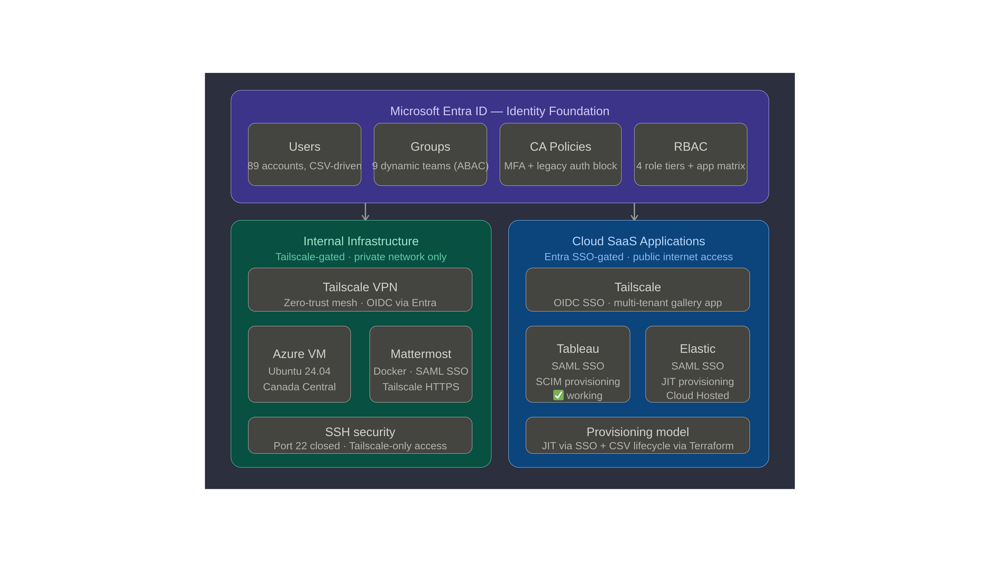
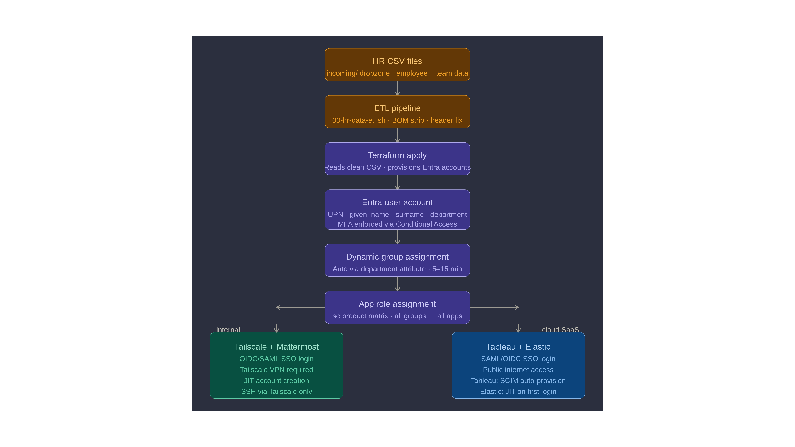

# WSHC — Entra ID Zero Trust IaC Lab

**Author:** Will Chang, Sr. IT Operations Engineer  
**GitHub:** https://github.com/willshchang/WSHC-Entra-IaC-Zero-Trust-Lab

---

## Overview

A personal lab project demonstrating enterprise-grade Microsoft Entra ID 
(formerly Azure Active Directory) identity infrastructure, built entirely 
with Terraform IaC (Infrastructure as Code) and secured with a Zero Trust 
identity and network architecture.

This lab simulates a real-world identity migration for TinyCo — a 
fictional 89-person startup — covering the full identity lifecycle from 
HR data ingestion to automated user provisioning, SSO across multiple 
SaaS platforms, and network-level Zero Trust identity enforcement via Tailscale.

---

## What This Lab Demonstrates

| Capability | Implementation |
|---|---|
| **Infrastructure as Code** | Terraform — full Entra ID environment deployable in under 5 minutes |
| **Zero Trust Architecture** | Two-layer model — Tailscale gates infrastructure, Entra SSO gates SaaS |
| **Dynamic Identity** | ABAC (Attribute-Based Access Control) via Entra dynamic groups |
| **Self-Healing Provisioning** | HR CSV → ETL pipeline → Terraform → Entra → auto group assignment |
| **SSO Integrations** | SAML + OIDC across Tailscale, Mattermost, Tableau, Elastic |
| **SCIM Provisioning** | Automated user lifecycle management via Tableau SCIM |
| **Security Model** | Conditional Access, MFA enforcement, least privilege RBAC |
| **Linux Administration** | Azure VM, Docker, Tailscale VPN, SSH hardening |

---

## Architecture

### Zero Trust — Two Layers

**Layer 1 — Network (Tailscale)**  
Internal resources (Azure VM, Mattermost) are unreachable from the 
public internet. SSH port 22 is closed. Access requires an active 
Tailscale VPN connection authenticated via Entra ID.

**Layer 2 — Identity (Entra ID SSO)**  
Cloud SaaS applications (Tableau, Elastic) are protected by Entra ID 
SSO via SAML or OIDC. MFA is enforced on every sign-in via 
Conditional Access.

### Identity Journey

From HR data to app access — fully automated:

---

## Tech Stack

| Layer | Technology |
|---|---|
| **Identity** | Microsoft Entra ID (E5) |
| **IaC** | Terraform (azuread + azurerm providers) |
| **Network** | Tailscale (Zero Trust VPN, exit node) |
| **VM** | Azure (Ubuntu 24.04, Standard B2s, Canada Central) |
| **Chat** | Mattermost (Docker Compose + Postgres 15, SAML SSO) |
| **Analytics** | Tableau Cloud (SAML SSO + SCIM provisioning) |
| **Observability** | Elastic Cloud — Kibana (SAML SSO) |
| **Scripting** | Bash (ETL pipeline, gallery lookup) |
| **Version Control** | GitHub |

---

## Repository Structure
WSHC-Entra-IaC-Zero-Trust-Lab/
│
├── README.md
├── scripts/
│   ├── 00-hr-data-etl.sh        ← HR data pipeline (run before terraform)
│   └── 01-gallery-lookup.sh     ← Microsoft gallery app search utility
│
├── terraform/
│   ├── providers.tf              ← Azure + Entra provider config
│   ├── variables.tf              ← Variable definitions (zero hardcoded values)
│   ├── terraform.tfvars         ← Values (gitignored)
│   ├── users.tf                  ← CSV-driven user provisioning
│   ├── groups.tf                 ← Dynamic ABAC groups + static admin groups
│   ├── rbac.tf                   ← Role assignments + app access matrix
│   ├── conditional-access.tf     ← MFA + legacy auth policies
│   ├── tailscale.tf              ← Tailscale app reference
│   ├── mattermost.tf             ← Mattermost SAML registration
│   ├── tableau.tf                ← Tableau SAML registration
│   ├── elastic.tf                ← Elastic SAML registration
│   └── apps-stub.tf              ← 10 stub app registrations
│
└── docs/
├── ARCHITECTURE.md           ← Technical decisions + design patterns
├── admin/
│   ├── 01-setup-guide.md     ← Full environment recreation guide
│   ├── 02-security-model.md  ← Security + privilege model
│   └── 03-provisioning.md    ← User lifecycle management
└── user/
├── 01-getting-started.md
└── 02-tailscale-troubleshooting.md

---

## Key Design Decisions

### Zero-Hardcode Architecture
No employee names, team names, or company data exists in any `.tf` 
file. All identity data flows from gitignored CSV files — mirroring 
a production HR system SCIM feed. Swap the CSV and the entire 
codebase deploys for any organisation.

### ABAC Dynamic Groups — Self-Healing Identity
Group membership is driven by Entra's ABAC engine, not manual 
Terraform assignments. Change a user's `department` attribute → 
Entra automatically moves them between groups within 5–15 minutes. 
No `terraform apply` needed for routine HR changes.

### setproduct RBAC Matrix
A single Terraform loop manages all group-to-app assignments using 
`setproduct()`. Add a new app → all groups get access automatically. 
Add a new group → it's included in all app assignments instantly.

### Gallery-First App Registration
Microsoft Entra Gallery apps come pre-configured with correct SSO 
protocols and permissions. Custom registrations default to OIDC — 
incompatible with many SaaS SAML implementations. Always search 
the gallery first.

### Dropzone ETL Pipeline
HR CSV exports use a staged dropzone architecture — files are 
explicitly placed in `incoming/` by an admin, sanitised by the 
ETL script, then staged in `data/` for Terraform. No wildcard 
searches, no accidental mass deprovisioning risk.

---

## Documentation Guide

| Goal | Document |
|---|---|
| Understand architecture and design decisions | [ARCHITECTURE.md](./docs/ARCHITECTURE.md) |
| Recreate the environment from scratch | [01-setup-guide.md](./docs/admin/01-setup-guide.md) |
| Understand the security and privilege model | [02-security-model.md](./docs/admin/02-security-model.md) |
| Manage users, groups, and applications | [03-provisioning.md](./docs/admin/03-provisioning.md) |
| End user onboarding guide | [01-getting-started.md](./docs/user/01-getting-started.md) |
| Tailscale VPN troubleshooting | [02-tailscale-troubleshooting.md](./docs/user/02-tailscale-troubleshooting.md) |

---

## Security Notes

- No credentials, PII, or sensitive data exists in this repository
- Employee CSV data is gitignored — never committed to version control
- `terraform.tfvars` is gitignored — all secrets stay local
- SSH port 22 is closed to the public internet — VM accessible via Tailscale only
- All app access enforced via Entra ID group assignments and Conditional Access