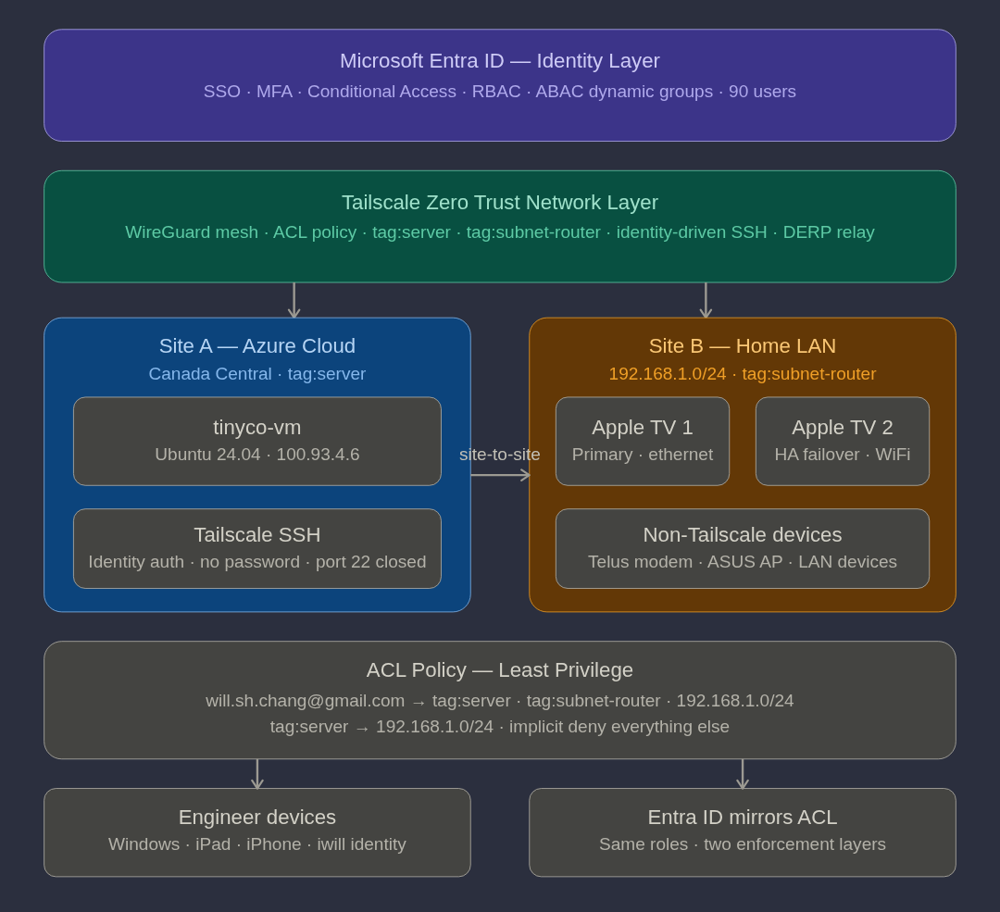

# Tailscale Network Architecture

**Document Type:** Network Architecture Reference  
**Author:** Will Chang, Tailscale Customer Success Engineer  
**Audience:** IT Administrator / Tailscale CSE Reference  
**Last Updated:** April 2026  
**Repository:** https://github.com/willshchang/WSHC-Entra-IaC-Zero-Trust-Lab  
**Official Reference:** https://tailscale.com/docs

---



## Overview

This document describes the full Zero Trust network architecture 
implemented in the WSHC lab — covering the Tailscale network 
layer, site-to-site topology, ACL policy design, and how it 
mirrors the Entra ID identity model.

For setup and troubleshooting procedures, see:
- [01-Tailscale_Subnet_Router_Setup_and_Troubleshooting.md](./01-Tailscale_Subnet_Router_Setup_and_Troubleshooting.md)
- [02-Tailscale_ACL_Tags_and_Access_Control.md](./02-Tailscale_ACL_Tags_and_Access_Control.md)

---

## Two-Layer Zero Trust Model

TinyCo's security architecture enforces Zero Trust at two 
independent layers:

| Layer | Tool | What it enforces |
|---|---|---|
| **Identity** | Microsoft Entra ID | Who can authenticate · SSO · MFA · RBAC |
| **Network** | Tailscale ACL | What authenticated devices can reach |

Neither layer trusts the other implicitly. A user must pass 
both identity verification (Entra ID → Tailscale SSO) AND 
network access control (Tailscale ACL policy) before reaching 
any resource.

---

## Network Topology

### Site A — Azure Cloud

| Property | Value |
|---|---|
| Location | Canada Central |
| Device | `tinyco-vm` — Ubuntu 24.04 |
| Tailscale IP | `100.93.4.6` |
| Tailscale tag | `tag:server` |
| SSH | Tailscale SSH — identity authenticated, no password |
| Port 22 | Closed via Azure NSG — public internet cannot reach |

### Site B — Home LAN

| Property | Value |
|---|---|
| Subnet | `192.168.1.0/24` |
| Tailscale tag | `tag:subnet-router` |
| Primary router | `iwilltvliving` — Apple TV, ethernet, `100.109.140.74` |
| HA router | `iwilltvmaster` — Apple TV, WiFi, `100.122.120.115` |
| Gateway | `192.168.1.254` — Telus fibre modem |
| AP | `192.168.1.59` — ASUS router (AP mode) |

### Engineer Devices

| Device | Tailscale name | Identity |
|---|---|---|
| Windows PC | `iwillwindows` | `will.sh.chang@gmail.com` |
| iPad Pro | `iwill14pro` | `will.sh.chang@gmail.com` |
| iPhone | `iwillprom4` | `will.sh.chang@gmail.com` |

---

## Tailscale SSH Architecture

### Before Tailscale SSH
Engineer → public internet → port 22 open → password auth → VM

Weaknesses:
- Port 22 exposed to the internet
- Password-based authentication
- No identity correlation
- No audit trail in Tailscale

### After Tailscale SSH
Engineer → Tailscale identity (Entra SSO) → ACL validates →
Tailscale intercepts SSH → VM (no open ports)

Improvements:
- Port 22 closed to public internet via Azure NSG
- Authentication via Tailscale identity — no password
- ACL policy controls who can SSH to what
- Full SSH session audit trail in Tailscale admin console
- Browser-based re-authentication available (`action: check`)

### SSH ACL Rule

```json
"ssh": [
    {
        "action": "accept",
        "src":    ["will.sh.chang@gmail.com"],
        "dst":    ["tag:server"],
        "users":  ["tinyco-admin", "iwill", "root"]
    }
]
```

---

## Site-to-Site Architecture

### How it works
Azure VM (Site A, 100.93.4.6)
↓ Tailscale encrypted tunnel
Apple TV subnet router (Site B, 100.109.140.74)
↓ SNAT — rewrites source IP
192.168.1.0/24 home LAN
→ 192.168.1.254 (Telus modem)
→ 192.168.1.59 (ASUS AP)
→ Any non-Tailscale device on the subnet

### Connection type

Traffic between Azure VM and Apple TV travels via DERP 
(Detoured Encrypted Routing Protocol) Seattle relay due to 
double NAT (Telus modem + ASUS AP mode). Traffic remains 
end-to-end encrypted — DERP only sees encrypted packets.

Typical latency:
- First packet: `~300ms` (DERP relay negotiation)
- Subsequent: `~75-85ms` (path optimised)

### SNAT behaviour

By default Tailscale uses SNAT (Source Network Address 
Translation) on subnet traffic. Devices on the home LAN see 
traffic as originating from the Apple TV's LAN IP — not the 
Azure VM's Tailscale IP.

---

## High Availability Subnet Routing

Two Apple TVs advertise the same `192.168.1.0/24` subnet:
iwilltvliving (primary, ethernet) ─── 192.168.1.0/24
iwilltvmaster (standby, WiFi)    ─── 192.168.1.0/24

Tailscale selects `iwilltvliving` as primary (lower latency 
via ethernet). If primary goes offline, Tailscale automatically 
fails over to `iwilltvmaster` — zero client configuration 
required.

**HA failover verified:**
Disabled primary subnet route in admin console → pinged 
`192.168.1.254` from Azure VM → 4/4 packets received via 
secondary Apple TV. Failover time: ~5 seconds.

**Verify active primary:**
```bash
tailscale status --json | python3 -c "
import json,sys
data=json.load(sys.stdin)
for peer in data.get('Peer',{}).values():
    routes=peer.get('PrimaryRoutes',[])
    if routes:
        print(peer['HostName'], routes)
"
```

---

## ACL Policy Design

### Design principle

> Identity drives access, tags define infrastructure roles. 
> ACL rules mirror the Entra ID RBAC model — one source of 
> truth for roles, two enforcement layers.

### Tag model

| Tag | Assigned to | Represents |
|---|---|---|
| `tag:server` | `tinyco-vm` | Cloud infrastructure |
| `tag:subnet-router` | Both Apple TVs | Network infrastructure |

User devices carry no tags — identified by Tailscale identity 
(`will.sh.chang@gmail.com`) which maps back to Entra ID via SSO.

### Access matrix

| Source | Destination | Access |
|---|---|---|
| `will.sh.chang@gmail.com` | `tag:server` | ✅ Full |
| `will.sh.chang@gmail.com` | `tag:subnet-router` | ✅ Full |
| `will.sh.chang@gmail.com` | `192.168.1.0/24` | ✅ Full |
| `tag:server` | `192.168.1.0/24` | ✅ Full |
| `tag:server` | user devices | ❌ Blocked (implicit deny) |
| `tag:subnet-router` | anywhere | ❌ Blocked (implicit deny) |
| anything else | anything else | ❌ Blocked (implicit deny) |

### Entra ID mirror (production design)

In a multi-user production tailnet, Tailscale groups would 
mirror Entra ID dynamic groups exactly:

```json
"groups": {
    "group:itops":    ["itops-member@company.com"],
    "group:sre":      ["sre-member@company.com"],
    "group:backend":  ["backend-member@company.com"]
},
"grants": [
    {
        "src": ["group:itops"],
        "dst": ["tag:server", "tag:subnet-router", "10.0.0.0/8"],
        "ip":  ["*"]
    },
    {
        "src": ["group:sre"],
        "dst": ["tag:server"],
        "ip":  ["tcp:22", "tcp:443"]
    },
    {
        "src": ["group:backend"],
        "dst": ["tag:server"],
        "ip":  ["tcp:443"]
    }
]
```

Same roles defined once in Entra ID, enforced at both identity 
and network layers.

---

## Linux-Specific Behaviour

Unlike Windows, macOS, iOS, and tvOS — Linux devices do not 
automatically accept advertised subnet routes. Explicit opt-in 
required:

```bash
sudo tailscale set --accept-routes
```

This is intentional security design — a rogue subnet router 
cannot inject routes into a Linux device without explicit 
consent.

---

## Production Enhancements

### Terraform IaC for ACL policy

```hcl
resource "tailscale_acl" "policy" {
  acl = jsonencode({
    tagOwners = {
      "tag:server"        = ["will.sh.chang@gmail.com"]
      "tag:subnet-router" = ["will.sh.chang@gmail.com"]
    }
    grants = [
      {
        src = ["will.sh.chang@gmail.com"]
        dst = ["tag:server"]
        ip  = ["*"]
      }
    ]
    ssh = [
      {
        action = "accept"
        src    = ["will.sh.chang@gmail.com"]
        dst    = ["tag:server"]
        users  = ["tinyco-admin", "iwill"]
      }
    ]
  })
}
```

### Direct P2P connection

Current DERP relay latency (~75ms) is acceptable for the lab. 
To establish direct P2P connection, enable UDP port forwarding 
on the Telus modem for port `41641` pointing to Apple TV LAN IP.

Note: This requires manual router configuration and partially 
defeats Tailscale's zero-configuration value proposition. 
DERP relay is the recommended approach for consumer network 
environments.

### SSH session recording

Tailscale SSH supports session recording — every SSH session 
captured and stored for audit. Requires Tailscale Enterprise 
plan.

```json
"ssh": [
    {
        "action": "accept",
        "src":    ["will.sh.chang@gmail.com"],
        "dst":    ["tag:server"],
        "users":  ["tinyco-admin"],
        "recordingTargets": ["tag:logging-server"]
    }
]
```

---

## Official References

| Topic | URL |
|---|---|
| Subnet routers | https://tailscale.com/docs/features/subnet-routers |
| Tailscale SSH | https://tailscale.com/docs/features/tailscale-ssh |
| ACL policy syntax | https://tailscale.com/docs/reference/syntax/policy-file |
| Tags | https://tailscale.com/kb/1068/acl-tags |
| HA subnet routing | https://tailscale.com/docs/how-to/set-up-high-availability |
| Site-to-site | https://tailscale.com/docs/features/site-to-site |
| DERP relay | https://tailscale.com/blog/how-tailscale-works |